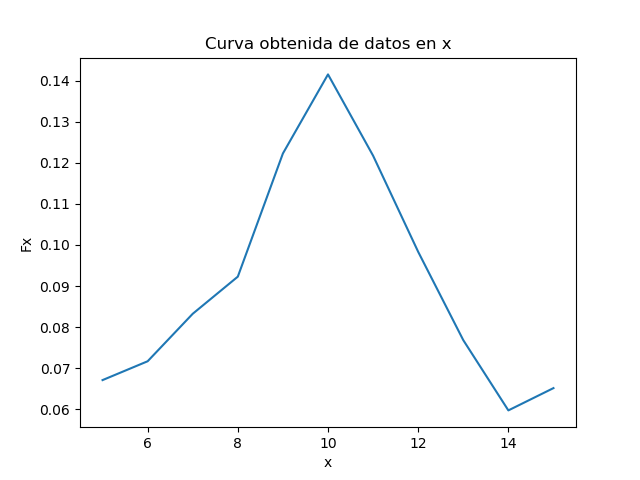
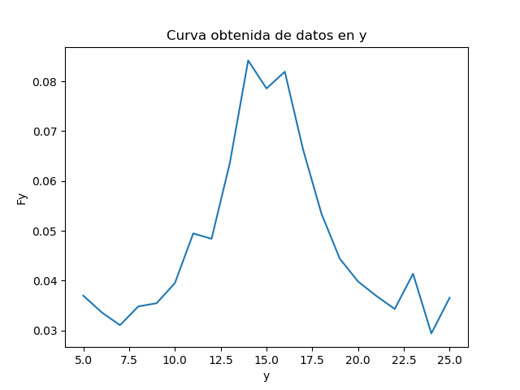
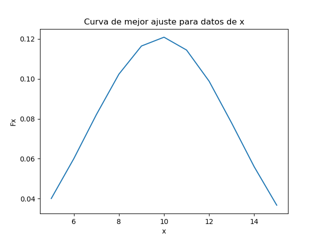
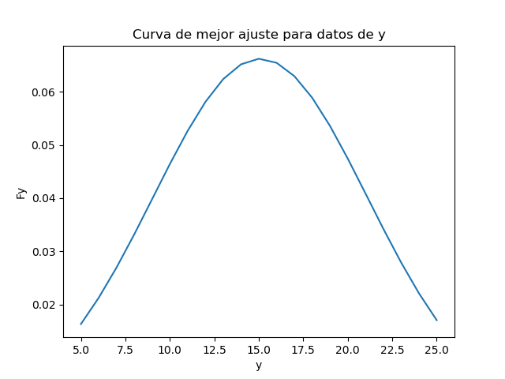
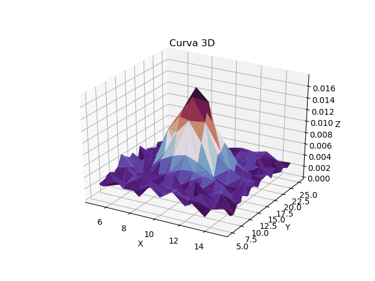

# Tarea 3 
# Variables aleatorias multiples
## Kaseng Fong 
## B42609


# Parte 1. 

Para obtener la mejor curva de ajuste para las funciones de las densidades marginales, a partir de los datos, se extrae los vectores mediante np.linspace los valores de las filas de X y las columnas de Y. Se extraen la sumatoria de cada columna y fila para la densidad marginal de X y Y  utilizando np.sum(), con estos datos se obtienen las graficas reales de las densidades marginales de Fx y Fy que se encuentran en la parte 4  del archivo. Seguidamente se procede a realizar el ajuste, donde se observa que el comportamiento de las graficas reales obtenidas representan una curva gaussiana, por lo que se define una funcion para obtener los parametros de "sigma" y "mu" donde se obtienen los siguientes parametros:

|        | X       | Y       |
|--------|---------|---------|
| $\sigma$ | 3.2994  |  6.0269 |
| $\mu$    | 9.90484 | 15.0794 |


``` python
xy = pd.read_csv("xy.csv",header = 0,index_col=0)

x = np.linspace(5,15,11)
y = np.linspace(5,25,21)

fy= np.sum(xy,axis=0)
fx= np.sum(xy,axis=1)

#Curva de mejor ajuste. 
def gaussiana(x,mu,sigma):
    return 1/(np.sqrt(2*np.pi*sigma**2))*np.exp(-(x-mu)**2/(2*sigma**2))

param_x,_=curve_fit(gaussiana,x,fx)
param_y,_=curve_fit(gaussiana,y,fy)

print(param_x)
print(param_y)
```

# Parte 2
Partiendo de que existe indenpendencia entre X y Y, entonces se tiene que   
  $f_{x,y}(x,y)= f_x(x)\cdot f_y(y)$

De los resultados de la grafica, se observa que ambos representan una tendencia de una curva gaussiana, entonces: 

$f(x)= ae^{\frac{-(x-\mu)^2}{2 \sigma^2}}$

$f(y)= be^{\frac{-(y-\mu)^2}{2 \sigma^2}}$

entonces la expresion de la funcion de densidad conjunta esta dado por: 

$f_{x,y}(x,y)= abe^{\frac{-(x-\mu)^2}{2 \sigma^2}}-\frac{-(y-\mu)^2}{2 \sigma^2}$

sustituyendo los valores respectivos de  $\sigma$, $\mu$ para X y Y entonces se tiene que la funcion de densidad conjunta es:

$f_{x,y}(x,y)= abe^{\frac{-(x-9.9)^2}{2 *3.3^2}}-\frac{-(y-15.07)^2}{2* 6.02^2}$


# Parte 3  


### 1. Correlacion : 
La correlacion indica cuanto grado de relacion estan asociados  linealmente una o mas variables. 
A partir  de los datos, se obtuvo una correlacion de 149.5428 entre las variables.

``` python
xyp = pd.read_csv("xyp.csv",header = 0)

#Correlacion
x_1 = xyp["x"] 
y_1 = xyp["y"] 
p_1 = xyp["p"]

correlation = 0 
for i in range(len(xyp)):
    correlation = correlation + x_1[i]*y_1[i]*p_1[i]; 
print( "La correlacion es :" ,correlation)

```


### 2. Covarianza:
La covarianza es una  medida  que indica cuanto puede cambiar de forma conjunta  dos variables aleatorias respecto a su medida, es decir, permite saber el comportamiento de una variable en funcion de la otra variable. La covarianza de la curva ajustada de los datos fue de  0.1831.

``` python

#Covarianza 
covariance = correlation - (param_x[0]*param_y[0])
print( "La covarianza es :" ,covariance)


```

### 3. Coeficiente de Covarianza:
El coeficiente de correlacion de Pearson, es el indice que mide el grado de covariacion entre distintas variables que se encuentren relacionadas linealmente, dicho valor debe de encontrarse entre -1 y 1.A partir de los datos se obtuvo que el coeficiente de correlacion es de 0.0092. 
``` python

# Coeficiente de covarianza
ccv = covariance/ (param_x[1]*param_y[1])
print( "El coeficiente de covarianza es :" ,ccv)


```


# Parte 4

## Curvas de las funciones de densidades marginales obtenidas de la parte 1. 


## 1. Curva de densidad marginal Fx

## 2. Curva de densidad marginal Fy

## 3. Curva de  mejor ajuste para la densidad marginal Fx

## 4. Curva de mejor ajuste para la densidad marginal Fy

## 5. Curva de densidad marginal conjunta


